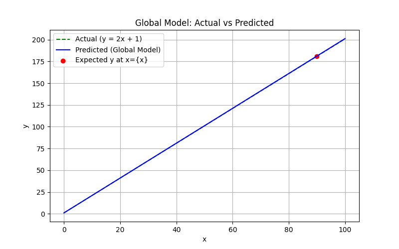

# FedLearn-Lite: Federated Learning for Linear Regression

A lightweight yet powerful federated learning simulation using Flower and TensorFlow — where multiple clients collaboratively train a shared global model without ever sharing their raw data.

> 📌 Perfect for demonstrating how decentralized learning can effectively learn a simple linear relationship: `y = 2x + 1`

---

## 🚀 Overview

`FedLearn-Lite` simulates a **realistic federated learning setup** across multiple clients. Each client owns a subset of data and trains a local model. A central server performs **Federated Averaging (FedAvg)** to aggregate the weights into a global model.

The project demonstrates:

- How **federated learning** works in a practical client-server architecture.
- How to split and distribute data across clients to preserve privacy.
- How a global model can learn a perfect linear mapping `y = 2x + 1` without any data centralization.
- Evaluation of global model after multiple rounds of learning.

---

## 🧠 Technologies Used

- [Flower](https://flower.dev) — Federated Learning Framework
- [TensorFlow](https://tensorflow.org) — Deep Learning Engine
- Python 3.x

---

## 🗂️ Project Structure

```text
FedLearn-Lite/
│
├── data/                     # Client-specific datasets
│   ├── client-data-1.csv
│   ├── client-data-2.csv
│   └── client-data-3.csv
│
├── weights/                  # Saved client model weights
│
├── model/                    # Saved global models after each round
│
├── plots/                    # Output visualizations (Actual vs Predicted)
│
├── model.py                  # Model architecture (Keras)
├── generate_data.py          # Script to generate and split data for clients
├── client.py                 # Federated client logic
├── server.py                 # Flower server with FedAvg strategy
├── test_model.py             # Evaluate and visualize final model
└── README.md
````

---

## 🧪 How to Run

### 1️⃣ Generate Sample Data

```bash
python generate_data.py
```

This will create a synthetic dataset for the function `y = 2x + 1` with slight noise and split it across 3 clients.

---

### 2️⃣ Start the Server

```bash
python server.py
```

This will:

* Launch the federated learning server
* Run for 5 federated rounds
* Save global model after each round
* Print performance on validation

---

### 3️⃣ Start Clients (in 3 separate terminals or background processes)

```bash
CLIENT_ID=1 python client.py
CLIENT_ID=2 python client.py
CLIENT_ID=3 python client.py
```

Each client trains on its own dataset and communicates only weights with the server.

---

### 4️⃣ Visualize Final Model

```bash
python test_model.py
```

This will:

* Load the final model (`global_model_round_5.h5`)
* Predict for a range of x values
* Plot both actual and predicted values
* Save the plot to `./plots/global_model_vs_actual.png`

---

## 📈 Sample Output



---

## 🔐 Privacy by Design

Unlike traditional ML, data **never leaves the client**. Only model weights are exchanged. This setup emulates a real-world federated scenario suitable for edge devices, IoT, healthcare, and finance domains.

---

## 🧩 Future Extensions

* Add support for non-linear functions and models
* Extend to image or tabular classification
* Add differential privacy or secure aggregation
* Enable real-time client participation via sockets or REST

---

## 🤝 Contributing

Pull requests are welcome! For major changes, please open an issue first to discuss what you would like to change or extend.

---

## 📜 License

This project is licensed under the MIT License.

---

## ✨ Acknowledgements

Thanks to the [Flower team](https://flower.dev) and TensorFlow community for building incredible tools for federated and distributed machine learning.

---

> "Federated Learning isn’t the future. It’s the present — distributed, private, and smarter."

```
